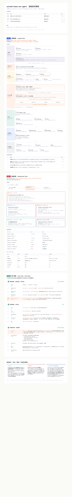
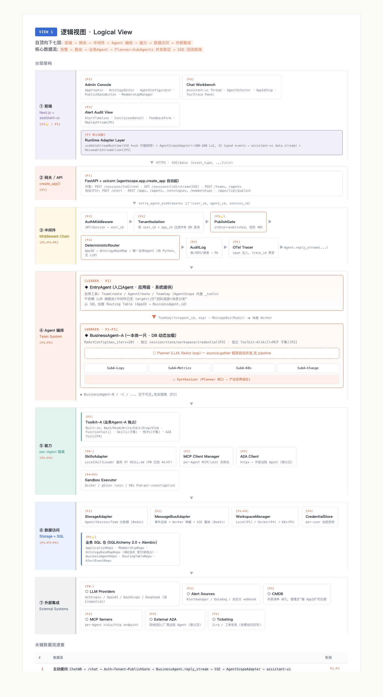
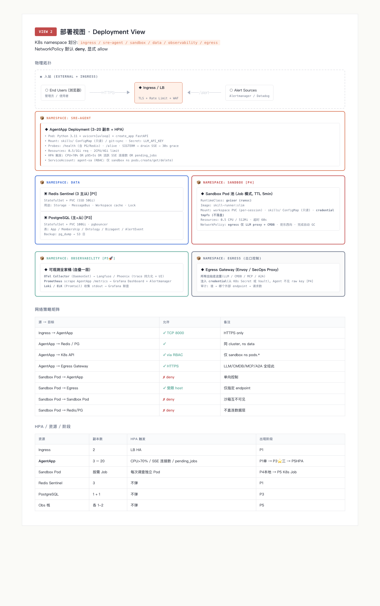
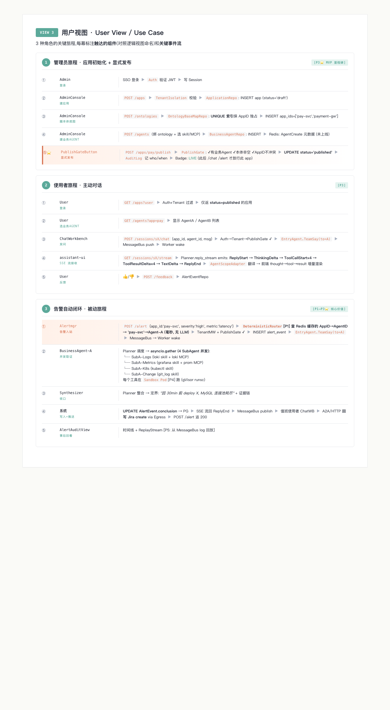

# umodel-base-sre-agent · 目标技术架构(三视图 v1)

> 基于 AgentScope 2.0 Python + assistant-ui 重构 IncidentFox 的目标技术架构。
> 三视图原则:同一组件在三张图里名称一致,P 阶段标记贯穿。
>
> **图例**:`▣` 存储 · `◆` 进程/Pod · `○` 外部 · `□` 模块 · `═══>` 同步 · `───>` 异步 · `~~~>` SSE · `┄┄>` 旁路观测
> **阶段标记**:`[P1]` `[P2]` `[P3⭐ MVP]` `[P4]` `[P5🚀]`
> **Web UI**:Next.js 14 + assistant-ui(MIT 10.5K stars, Runtime Adapter ~100-200 LoC 接 AgentScope SSE)

## 可视化版本(GitHub 预览)

> 完整 HTML 可视化 / PDF / 单视图大图见 `../../agent-redesign/images/`(同 git workspace 下)



详细分视图(点开看大图):

| 视图 | 图 |
|------|-----|
| 逻辑视图 |  |
| 部署视图 |  |
| 用户视图 |  |

下面是 ASCII 详细版(可在终端/任意 markdown 渲染器阅读)。

---

---

## 视图一 · 逻辑视图(Logical View)

自顶向下七层:**前端 → 网关 → 中间件 → Agent 编排 → 能力 → 数据访问 → 外部集成**。
核心数据流:`告警 → 路由 → 业务Agent → Planner→SubAgents 并发取证 → 事件流 ~~~> SSE 回流前端`

```
╔════════════════════════════════════════════════════════════════════════════════════════╗
║                       ① 前端层 (Frontend Layer) [P3⭐ / P5]                              ║
║──────────────────────────────────────────────────────────────────────────────────────────║
║ ┌─ Next.js 14 App Router + React 19 + TypeScript [P3] ───────────────────────────────┐ ║
║ │ ┌─ Admin Console [P3]─────┐ ┌─ Chat Workbench [P3]──┐ ┌─ Alert Audit View [P3]──┐ │ ║
║ │ │ □ AppCreator            │ │ □ AssistantUI Thread  │ │ □ AlertTimeline         │ │ ║
║ │ │ □ OntologyEditor        │ │   (assistant-ui)      │ │ □ ConclusionDetail      │ │ ║
║ │ │ □ AgentConfigurator     │ │ □ AgentSelector       │ │ □ FeedbackForm          │ │ ║
║ │ │ □ PublishGateButton     │ │ □ AppIdContextChip    │ │ □ ReplayStream [P5]     │ │ ║
║ │ │ □ MembershipManager     │ │ □ ToolTrace Panel     │ │                         │ │ ║
║ │ └─────────────────────────┘ └───────────────────────┘ └─────────────────────────┘ │ ║
║ │ ┌─ Runtime Adapter Layer [P3] ───────────────────────────────────────────────────┐ │ ║
║ │ │ □ useDataStreamRuntime  (assistant-ui SSE hook,开箱即用)                       │ │ ║
║ │ │ □ AgentScopeAdapter (~100-200 LoC,32 typed events ↔ assistant-ui data stream) │ │ ║
║ │ │ □ ResumableStreamClient (last_event_id 重连) [P5]                              │ │ ║
║ │ └────────────────────────────────────────────────────────────────────────────────┘ │ ║
║ └────────────────────────────────────────────────────────────────────────────────────┘ ║
╚════════════════════════════════════════════════════════════════════════════════════════╝
                  │ HTTPS                            ▲ SSE
                  ▼                                  │
╔════════════════════════════════════════════════════════════════════════════════════════╗
║                  ② 网关/API 层 (create_app() 提供) [P1]                                  ║
║──────────────────────────────────────────────────────────────────────────────────────────║
║ □ FastAPI (agentscope.app.create_app 自动起) + uvicorn                                  ║
║   内置: POST /sessions/{id}/chat · GET /sessions/{id}/stream(SSE) · POST /teams,/agents  ║
║   自加 [P3]: POST /alert · REST /apps,/agents,/ontologies,/memberships · /apps/{id}/publish ║
╚════════════════════════════════════════════════════════════════════════════════════════╝
                  │  extra_agent_middlewares 工厂 factory(user_id, agent_id, session_id)
                  ▼
╔════════════════════════════════════════════════════════════════════════════════════════╗
║                    ③ 中间件层 (Middleware Chain) [P1→P3→P5]                              ║
║──────────────────────────────────────────────────────────────────────────────────────────║
║  request ─▶ □ AuthMiddleware [P3]      (JWT/Session → user_id)                          ║
║          ─▶ □ TenantIsolation [P3]     (按 user_id × app_id 过滤所有 DB 查询)           ║
║          ─▶ □ PublishGate [P3⭐]        (校验 app.status==published, 否则 403)          ║
║          ─▶ □ DeterministicRouter [P1]  (告警 AppID → OntologyBaseMap → 唯一业务Agent)  ║
║          ─▶ □ AuditLog [P3]            (写谁/何时/调了哪个 Agent → PG)                  ║
║          ─▶ □ OTel Tracer [P5]         (span 注入, trace_id 贯穿)                       ║
║          ─▶ Agent.reply_stream(...)                                                      ║
╚════════════════════════════════════════════════════════════════════════════════════════╝
                  ▼
╔════════════════════════════════════════════════════════════════════════════════════════╗
║         ④ Agent 编排层 (Team System · agentscope.agent + app._tools) [P1→P3]             ║
║──────────────────────────────────────────────────────────────────────────────────────────║
║   ┌────────────────────────────────────────────────────────────────────────────────┐    ║
║   │  [Leader]  ◆ EntryAgent (入口Agent · 应用级 · 系统提供) [P1]                    │    ║
║   │  ─ 工具: TeamCreate / AgentCreate / TeamSay (AgentScope 内置 _tools)            │    ║
║   │  ─ 不依赖 LLM 做路由(中间件已定 target); 仅"团队组装+消息分发"                  │    ║
║   │  ─ 从 SQL 加载 Routing Table (AppID → BusinessAgent.id)                         │    ║
║   └─────────────────────┬──────────────────────────────────────────────────────────┘    ║
║                         │ TeamSay(to=agent_id, msg) ─ MessageBus(Redis) ─▶ 唤醒 Worker  ║
║                         ▼                                                                ║
║   ┌────────────────────────────────────────────────────────────────────────────────┐    ║
║   │  [Worker]  ◆ BusinessAgent-A (一本体一只 · DB 动态加载) [P1→P3]                │    ║
║   │  ─ ReActConfig(max_iters=20) · 独立 session/state/workspace/credential [P3]    │    ║
║   │  ─ 独立 Toolkit-A (skill 子集 + MCP 子集) [P2]                                 │    ║
║   │                                                                                 │    ║
║   │     □ Planner (LLM, ReAct loop)                                                │    ║
║   │             │ asyncio.gather (框架自动并发, 无 pipeline)                        │    ║
║   │     ┌───────┼───────┬───────┬───────┐                                          │    ║
║   │     ▼       ▼       ▼       ▼                                                  │    ║
║   │  □ SubA   □ SubA  □ SubA  □ SubA  (Logs / Metrics / K8s / Change 并发取证)     │    ║
║   │     │       │       │       │                                                   │    ║
║   │     └───────┴───┬───┴───────┘                                                   │    ║
║   │                 ▼                                                                │    ║
║   │     □ Synthesizer (Planner 收口 → 产出定界结论)                                  │    ║
║   └────────────────────────────────────────────────────────────────────────────────┘    ║
║   ◆ BusinessAgent-B / -C / ... 互不可见, 完全隔离 [P2]                                  ║
╚════════════════════════════════════════════════════════════════════════════════════════╝
                  ▼
╔════════════════════════════════════════════════════════════════════════════════════════╗
║                  ⑤ 能力层 (Capability Layer · per-Agent 隔离) [P2→P4]                    ║
║──────────────────────────────────────────────────────────────────────────────────────────║
║  ┌─ Toolkit-A (业务Agent-A 独占) [P2] ──────────────────────────────────────────────┐  ║
║  │  □ Built-in Tools: Bash / Read / Write / Edit / Grep / Glob (AgentScope 内置)    │  ║
║  │  □ FunctionTool[]: Python 函数(自动生成 JSON schema)                              │  ║
║  │  □ Skills: LocalSkillLoader(k8s, grafana 等业务子集) [P2]                         │  ║
║  │  □ MCPs: StdioMCPConfig(payment-cmdb) [P2]                                        │  ║
║  │  □ A2A Tools: FunctionTool(call_remote_a2a, endpoint=...) [P4]                   │  ║
║  └────────────────────────────────────────────────────────────────────────────────────┘  ║
║  ┌─ 共享能力组件 ────────────────────────────────────────────────────────────────────┐  ║
║  │  □ SkillsAdapter (复用 IncidentFox 47 SKILL.md, P0 已验 44/47) [P0✓]              │  ║
║  │  □ MCP Client Manager (per-Agent MCPClient 实例池) [P2]                            │  ║
║  │  □ A2A Client (httpx → 外部远程 Agent, 默认空) [P4]                                │  ║
║  │  □ Sandbox Executor: Docker / gVisor runsc / K8s Pod-per-investigation [P4→P5]   │  ║
║  └────────────────────────────────────────────────────────────────────────────────────┘  ║
╚════════════════════════════════════════════════════════════════════════════════════════╝
                  ▼
╔════════════════════════════════════════════════════════════════════════════════════════╗
║                      ⑥ 数据访问层 (Data Access Layer) [P1→P3→P4]                          ║
║──────────────────────────────────────────────────────────────────────────────────────────║
║  ┌─ AgentScope 原生 ─────────────────────────────────────┐                              ║
║  │ □ StorageAdapter (Agent/Session/Team 元数据) [P1]      │                              ║
║  │ □ MessageBusAdapter (事件总线 + Worker 唤醒 + SSE 重放) [P1]                         ║
║  │ □ WorkspaceManager: Local(P1) / Docker(P4) / K8s(P5)   │                              ║
║  │ □ CredentialStore (per-user 加密密钥) [P4]              │                              ║
║  └──────────────────────────────────────────────────────────┘                            ║
║  ┌─ 业务 SQL 仓 (SQLAlchemy 2.0 + Alembic) [P3] ─────────┐                              ║
║  │ □ ApplicationRepo (app_id, status: draft/published)                                  ║
║  │ □ MembershipRepo (user_id, app_id, role)                                             ║
║  │ □ OntologyBaseMapRepo (id, app_ids[]) ── UNIQUE 索引保独占                           ║
║  │ □ BusinessAgentRepo (id, ontology_id, planner_cfg, skills[], mcps[], a2a[])         ║
║  │ □ RoutingTableRepo (派生视图: AppID → AgentID)                                       ║
║  │ □ AlertEventRepo (告警入站审计 + 结论)                                                ║
║  └──────────────────────────────────────────────────────────┘                            ║
╚════════════════════════════════════════════════════════════════════════════════════════╝
                  ▼
╔════════════════════════════════════════════════════════════════════════════════════════╗
║                          ⑦ 外部集成 (External Integrations)                              ║
║──────────────────────────────────────────────────────────────────────────────────────────║
║  ○ LLM Providers [P0✓]: Anthropic / OpenAI / DashScope / DeepSeek (经 Credential)       ║
║  ○ Alert Sources [P1]:  Alertmanager / Datadog / 自定义 webhook → POST /alert           ║
║  ○ CMDB [P3]: 外部清单 API,管理员"圈 AppID"时拉取                                        ║
║  ○ MCP Servers [P2]:  per-Agent stdio/http MCP endpoint                                  ║
║  ○ External A2A [P4]:  其他团队/厂商远程 Agent endpoint(默认空)                          ║
║  ○ Ticketing [P3]:  Jira / 工单系统(告警结论回写)                                        ║
╚════════════════════════════════════════════════════════════════════════════════════════╝
```

### 关键数据流速查

| # | 数据流 | 阶段 |
|---|---|---|
| 1 | 主动提问: `ChatWB → /chat → Auth→Tenant→PublishGate → BusinessAgent.reply_stream → SSE → AgentScopeAdapter → assistant-ui` | P1→P3 |
| 2 | 告警闭环: `Alertmanager → /alert → DeterministicRouter → EntryAgent.TeamSay → MessageBus → Worker → Planner→SubAgents 并发 → Synthesizer → AlertEvent 写库 + SSE 推 + 工单回写` | P1→P3⭐ |
| 3 | per-Agent 隔离: `AgentCreate → 从 BusinessAgentRepo 读 skills/mcps → 实例化独立 Toolkit-A → A 永远看不见 B 的工具` | P2 |
| 4 | 可观测旁路: `Agent.reply ┄┄> OTel span → Langfuse;tool 调用 ┄┄> Prometheus;stderr ┄┄> Loki` | P5 |

---

## 视图二 · 部署视图(Deployment View)

K8s namespace 划分:`ingress / sre-agent / sandbox / data / observability / egress`
NetworkPolicy 默认 deny,显式 allow。

```
                              ┌────────────────────────────┐
                              │  ○ End Users (浏览器)       │
                              │     - 管理员 / 使用者        │
                              └─────────────┬──────────────┘
                                            │ HTTPS
                                            ▼
   ┌──────────────┐                ┌──────────────────────────┐
   │○ Alert Source│── /alert ─────▶│ ◆ Ingress / LB           │
   │ (Alertmgr)   │                │ TLS + Rate Limit + WAF   │
   └──────────────┘                └─────────────┬────────────┘
                                                 │ K8s Service
                                                 ▼
╔══ namespace: sre-agent ═══════════════════════════════════════════════════╗
║ ┌──────────────────────────────────────────────────────────────────────┐ ║
║ │ ◆ AgentApp Deployment (3-20 副本, HPA: CPU>70% OR p95>5s OR SSE 连接) │ ║
║ │  Pod: Python 3.11 + uvicorn[uvloop] + create_app FastAPI              │ ║
║ │  Mount: skills/ ConfigMap (只读) / git-sync                            │ ║
║ │  Probes: /health (readiness 含 PG/Redis) /alive (liveness)            │ ║
║ │  SIGTERM → drain SSE → 30s grace                                       │ ║
║ │  Resources: 0.5/1Gi req · 2CPU/4Gi limit                              │ ║
║ │  ServiceAccount: agent-sa (RBAC: pods.create/get/delete in sandbox ns)│ ║
║ │  Secret: LLM_API_KEY (CredentialStore 主密钥)                         │ ║
║ └──────────────────────────────────────────────────────────────────────┘ ║
╚══════════│══════════════│═══════════════════════════════│════════════════╝
           │              │                               │
           ▼              ▼                               ▼
╔ ns:data ═══╗    ╔ ns:sandbox ══════════════════╗
║▣Redis Sent.║    ║◆ Sandbox Pod 池 (TTL 5min)   ║
║ 3 主从     ║    ║  RuntimeClass: gvisor(runsc)  ║
║ - Storage  ║    ║  Image: skill-runner:slim     ║
║ - MsgBus   ║    ║  Mount:                       ║
║ - Workspace║    ║   - workspace PVC(per-session)║
║ - Lock     ║    ║   - skills/ ConfigMap(只读)   ║
║ PV: SSD 50Gi    ║   - credential tmpfs(不落盘) ║
╠════════════╣    ║  Resources: 0.5 CPU/512Mi     ║
║▣PostgreSQL ║    ║  NetworkPolicy:               ║
║ 主+从 100Gi║    ║   - egress 仅允许 LLM proxy   ║
║ pgbouncer  ║    ║     + CMDB                    ║
║ 表: App/   ║    ║   - 拒东西向流量              ║
║   Membership/   ║  Job 完成 → Pod 自动 GC     ║
║   Ontology/║    ╚═══════════════════════════════╝
║   Bizagent/║
║   AlertEvent    ╔ ns:observability [P5🚀] ═══════════════════════════════╗
║ Backup: S3 ║    ║ ◆ OTel Coll. → Langfuse · Prometheus · Loki · Grafana  ║
╚════════════╝    ╚══════════════════════════════════════════════════════════╝

╔ ns:egress (出口控制) ═══════════════════════════════════════════════════════╗
║ ◆ Egress Gateway (Envoy / SecOps Proxy)                                    ║
║   ─ 所有出站走这里(LLM/CMDB/MCP/A2A)                                       ║
║   ─ 注入 credential(从 K8s Secret 或 Vault),Agent 不见 raw key [P4]       ║
║   ─ 审计: 谁→哪个外部 endpoint→请求数                                       ║
║                                                                              ║
║       ▼          ▼            ▼              ▼                              ║
║  ○ LLM API   ○ CMDB      ○ MCP Servers   ○ A2A(默认空)                     ║
╚══════════════════════════════════════════════════════════════════════════════╝
```

### 网络策略矩阵

| 源 → 目标 | 允许 | 备注 |
|---|---|---|
| Ingress → AgentApp | ✅ TCP 8000 | HTTPS only |
| AgentApp → Redis / PG | ✅ | 同 cluster `data` ns |
| AgentApp → K8s API | ✅ | RBAC: 仅 sandbox ns pods.* |
| AgentApp → Egress | ✅ HTTPS | LLM/CMDB/MCP/A2A 全经此 |
| Sandbox Pod → AgentApp | ❌ deny | 单向控制 |
| Sandbox Pod → Egress | ✅ 受限 host list | 仅允许 endpoint |
| Sandbox Pod → Sandbox Pod | ❌ deny | 沙箱互不可见 |
| Sandbox Pod → Redis/PG | ❌ deny | 沙箱不直连数据层 |

### HPA / 资源 / 阶段

| 资源 | 副本 | HPA 触发 | 阶段 |
|---|---|---|---|
| Ingress | 2 | LB HA | P1 |
| AgentApp | 3–20 | CPU>70% / SSE 连接数 / pending_jobs | P1单 → P3⭐三 → P5HPA |
| Sandbox Pod | 按需 Job | 每次调查独立 Pod | P4本地 → P5 K8s Job |
| Redis Sentinel | 3 | 不弹 | P1 |
| PostgreSQL | 1+1 | 不弹 | P3 |
| Obs 栈 | 各 1-2 | 不弹 | P5 |

---

## 视图三 · 用户视图(User View / Use Case)

### 旅程一 · 管理员旅程(应用初始化 + 显式发布) `[P3⭐]`

```
Admin → AdminConsole → FastAPI → Middleware → Repos(PG) → Redis(Storage)
 ①登录 SSO ──▶ Auth ──▶ Session
 ②建应用(draft) ──▶ POST /apps ──▶ Tenant校验 ──▶ INSERT app(status='draft')
 ③建本体底图 ──▶ POST /ontologies ──▶ AppID 独占校验(UNIQUE 索引)
   ──▶ INSERT ontology app_ids=['pay-svc','payment-gw']
 ④建业务Agent ──▶ POST /agents (绑 ontology, 选 skill/MCP)
   ──▶ INSERT business_agent ──▶ (Redis: AgentCreate 元数据写入但未上线)
 ⑤显式发布 ⭐ ──▶ POST /apps/pay/publish
   ──▶ PublishGate: ✓有业务Agent ✓本体非空 ✓AppID不冲突
   ──▶ UPDATE status='published' ──▶ AuditLog(who/when)
   ──▶ Badge: LIVE  (此后 /chat /alert 才放行此 app)
```

触达组件:`AdminConsole`(AppCreator/OntologyEditor/AgentConfigurator/PublishGateButton) + Auth/Tenant/**PublishGate ⭐**/AuditLog + 6 个 SQL Repo
关键事件:`app.created → ontology.created → agent.created → app.published`

### 旅程二 · 使用者旅程(主动对话) `[P3]`

```
User → ChatWorkbench(assistant-ui) → FastAPI → Middleware → EntryAgent(Leader) → BusinessAgent-A(Worker) → Redis Bus
 ①登录已发布应用 ──▶ GET /apps?user (Tenant过滤,仅 status=published)
 ②选业务Agent ──▶ GET /agents?app=pay
 ③发问(订单延迟) ──▶ POST /sessions/sX/chat {app_id, agent_id, msg}
   ──▶ Auth → Tenant → PublishGate ✓
   ──▶ EntryAgent.TeamSay(to=A) ──▶ MessageBus push ──▶ Worker wake
 ④SSE 流式接收 ──▶ GET /sessions/sX/stream
   ──▶ Planner.reply_stream emits:
       ReplyStart / ThinkingDelta / ToolCallStart(并发4) / ToolResultDelta×4 / TextDelta / ReplyEnd
   ──▶ AgentScopeAdapter (32 events → assistant-ui data stream)
   ──▶ 前端 thought→tool→result 增量渲染
 ⑤反馈 ──▶ POST /feedback → AlertEventRepo
```

触达组件:`ChatWorkbench` + `useDataStreamRuntime` + **`AgentScopeAdapter`** + ResumableStreamClient[P5] + Auth/Tenant/PublishGate + EntryAgent[P1] + BusinessAgent-A(含 Planner+SubAgents)[P1→P3] + MessageBus

### 旅程三 · 告警自动闭环(被动) `[P1→P3⭐]`

```
Alertmgr → Ingress → POST /alert → DeterministicRouter → EntryAgent → BusinessAgent-A → MessageBus → Sandbox → Egress → 工单/前端
 ①告警入站 {app_id:'pay-svc', severity:'high', metric:'latency'}
   ──▶ DeterministicRouter[P1]: 查 Redis 缓存的 AppID→AgentID 映射
   ──▶ 命中: 'pay-svc'→Agent-A (毫秒, 无 LLM)
   ──▶ TenantMW 注入应用上下文 + PublishGate ✓
   ──▶ INSERT alert_event {id,app,agent,ts}
   ──▶ EntryAgent.TeamSay(to=A, msg=告警上下文)
   ──▶ MessageBus push → Worker wake
 ②业务Agent 调度 Planner → 并发 4 个 SubAgent (asyncio.gather)
       SubA-Logs    (loki skill + loki MCP)
       SubA-Metrics (grafana skill + prom MCP)
       SubA-K8s     (kubectl skill)
       SubA-Change  (git_log skill)
   每个工具在 Sandbox Pod[P4] 跑(gVisor runsc)
 ③Synthesizer 收口: "因 30min 前 deploy X, MySQL 连接池耗尽" + 证据链
 ④结论写入 + 推送
   UPDATE AlertEvent.conclusion ──▶ PG
   SSE 流回 ReplyEnd + conclusion ──▶ MessageBus publish ──▶ 值班使用者 ChatWB
   A2A/HTTP 回写工单 ──▶ Jira create via Egress
   POST /alert 返回 200 OK (告警已受理, async)
 ⑤值班使用者审计回看 [P3]: AlertAuditView 时间线 + ReplayStream[P5从MessageBus log 回放]
```

触达组件:Ingress + AgentApp + **`DeterministicRouter`[P1]** + TenantMW/PublishGate/AuditLog + EntryAgent(Leader)[P1] + MessageBus[P1] + BusinessAgent-A 内 Planner+4 SubAgents[P1] + Synthesizer[P3] + 各 SubAgent 独立 Toolkit[P2] + Sandbox[P4] + AlertEventRepo[P3] + Egress→Jira[P3]

---

## 300 字架构总评

**最大优点**:把 **AgentScope 2.0 的"工业基础设施"和 assistant-ui 的"前端事件流标准"作为两根承重柱**,自研代码量被严格控制在"业务逻辑"上 —— `create_app()` 一行起 FastAPI+SSE+多租户钩子,`LocalSkillLoader` 零改动复用 IncidentFox 47 SKILL.md,`AgentScopeAdapter` 仅 100-200 LoC 把 32 typed events 翻译成前端协议。**三层(Leader-Worker)、确定性路由、per-Agent 隔离、沙箱可切、可观测旁路**这五个 SRE 平台硬需求全有现成位置,P0→P5 是"在已搭好骨架上长肉",不是边长骨头边长肉。

**最大风险**:**AgentScope 2.0(2026-05)生产案例稀缺** —— `create_app` 端点行为、`MessageBus` 高并发 SSE 反压、`extra_agent_middlewares` 多租户隔离强度、A2A 实验性接口稳定性 —— 四块都要在 P1→P3 用真实压力**反复验证**,任何一处不稳就要 fallback 到自研适配层。第二风险是**前端 SSE 长连接**(N×浏览器 × M×并发 Agent),HPA 不能只看 CPU,必须把"活跃 SSE 连接数"作为弹性指标。

**与 IncidentFox 的根本差别**:IncidentFox 是 **"9 个角色 Agent 共享同一引擎,靠提示词分化"** 的拍平架构(Claude SDK 结构性不支持多层/per-Agent 隔离/主动 A2A);新架构是 **"业务 Agent 作为一等实体,绑本体、独立工具集、可独立沙箱、显式发布门禁"** 的真正分层多租户系统 —— **告警路由从'让 LLM 猜'升级为'按表毫秒级命中'**,**前端从自研字符串协议升级为 assistant-ui 标准 data stream**,**密钥从落盘升级为运行时注入沙箱 tmpfs**。一句话:IncidentFox 是"穿西装的 ReAct loop",新架构是"按企业架构三视图原则建的 SRE Agent 平台"。

---

## 关键文件(实施落地位置)

- `src/sre_agent/app.py` — `create_app` 入口,P1 三层 Team 起点
- `src/sre_agent/routing/` — DeterministicRouter middleware [P1]
- `src/sre_agent/agents/` — EntryAgent + BusinessAgent [P1→P3]
- `src/sre_agent/models/` — Application/Ontology/BusinessAgent SQL [P3 MVP]
- `src/sre_agent/skills_adapter.py` — LocalSkillLoader 包装 [P0 已验]
- (待新建) `umodel-base-sre-agent-web/` — Next.js + assistant-ui [P3]
  - `app/(admin)/` `app/(chat)/` `app/(audit)/` `lib/agentscope-adapter.ts`

---

> 配套:`../README.md` 项目状态 · `../../agent-redesign/requirements-v1.md` 需求 v1 · `../../agent-redesign/architecture-evolution.html` 6 阶段演进图
